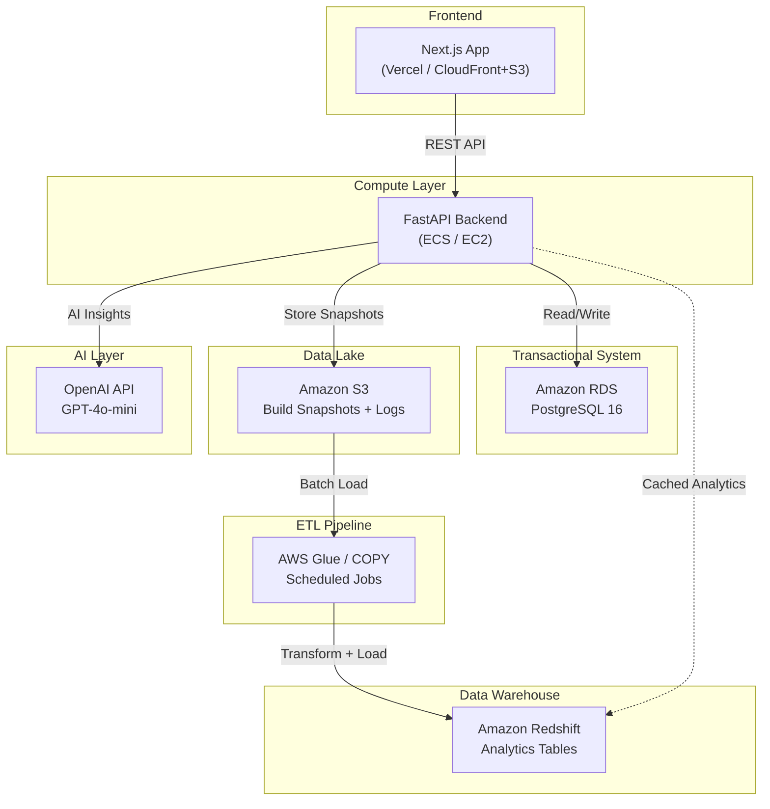
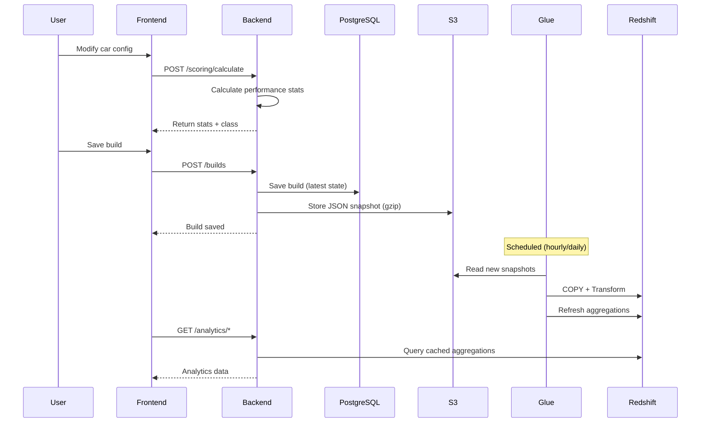

# AutoForge AI — AWS Architecture

## System Architecture Diagram



## Data Flow



## S3 Data Lake Structure

```
s3://revcraft-data-lake/
├── builds/
│   └── {user_id}/
│       └── {build_id}/
│           └── {timestamp}.json.gz
├── logs/
│   └── {user_id}/
│       └── {date}/
│           └── {timestamp}_{action}.json.gz
└── exports/
    └── users/
        └── users_export.json
```

## Redshift Schema

| Table | Type | Purpose |
|-------|------|---------|
| `fact_builds` | Fact | Every build snapshot (dist by user_id, sort by timestamp) |
| `dim_users` | Dimension | User lookup (dist ALL) |
| `agg_class_distribution` | Aggregate | Class counts + percentages |
| `agg_leaderboard` | Aggregate | Top 100 builds ranked |
| `agg_daily_trends` | Aggregate | Daily avg scores + build counts |
